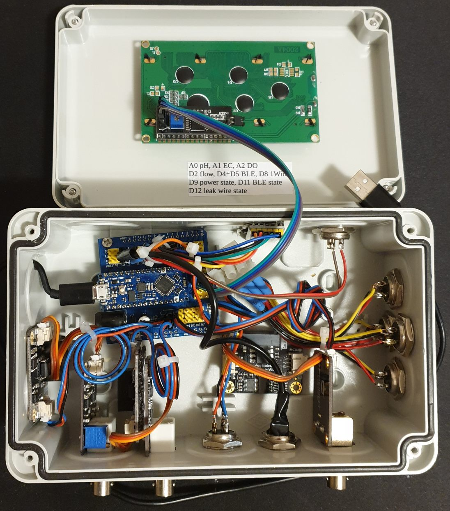
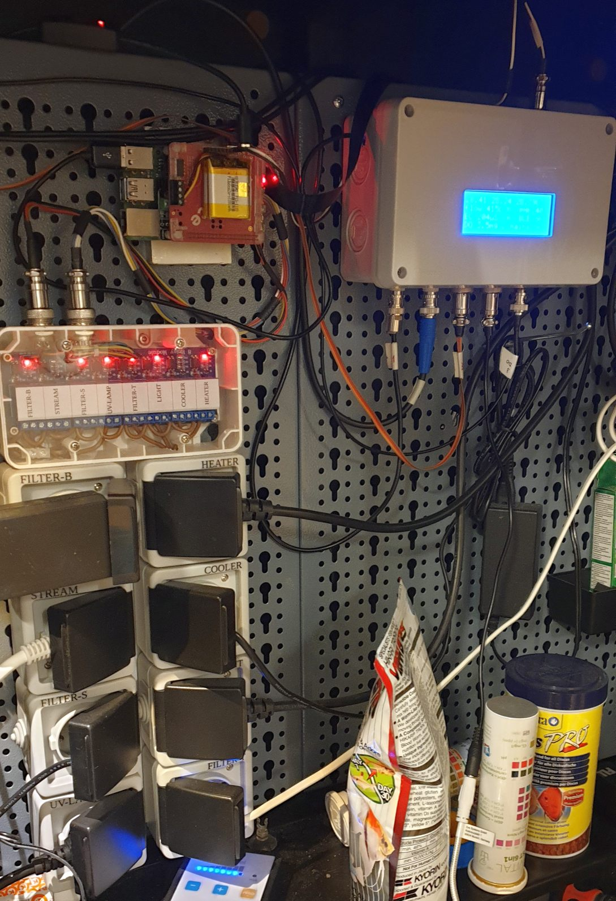

# ArdquariumPi

## Hardware

Shown below is an Arduino system that I have built for my aquarium. 

{:height="100%" width="100%"}

Here I utilize
- Arduino Nano Every,
- Nano I/O Expansion Sensor Shield,
- 4 parallel connectors for 1-Wire thermistors DS18B20,
- sensor boards measuring pH, EC (electrical conductivity) and DO (dissolved
  oxygen) with analog insulation boards,
- a connector to a pulse generating flow-meter device,
- a connector to monitor the external power supply state (before the UPS board
  of Raspberry Pi),
- a connector to a leak sensor wire,
- BLE module HM10,
- a 20×4 LCD display (a 16×2 display is also possible and was used earlier).

When I was building the system, I connected the devices one by one and tested
them with the supplied test scripts, find them in "arduino" folder. A Windows
computer and a Raspberry Pi computer are equally good for running the Arduino
IDE.

I use Raspberry Pi 4/B as passively cooled, with a UPS hat (PiJuice) and a GPIO
connector hat, see below.

{:height="100%" width="100%"}

{:height="100%" width="100%"}

The GPIO pins are wired to an 8-Relais Module that controls 8 power sockets.
The relais and the sockets form a single unit with all the high voltage wires
encapsulated in it.

{:height="75%" width="75%"}

I have an old phone located close to the Arduino that is connected via BLE. It
has a cheap pre-paid SIM card and can send alarm texts. Quite a problem is that
the phone may drop the BLE connection when the screen goes to energy saving
mode. On this particular phone the problem was solved by disabling the energy
saving mode.

## Software

ArdquariumPi was tested on Raspberry Pi OS Bullseye (Debian 11) and earlier on
Raspberry Pi OS Buster (Debian 10). It should run on other desktops as well,
e.g. Ubuntu Desktop, except the camera functionality may fail there.

I recommend running Raspberry Pi OS in the desktop mode, not the CLI mode, as
one can utilize several useful desktop facilities there, such as pijuice GUI,
Arduino IDE, text editors and file managers. For this, enable boot to Desktop,
and edit "boot/config.txt": "hdmi_force_hotplug=1" for running Raspberry Pi
without a screen. Enable the VNC service, and run your Raspberry Pi desktop
remotely. Use a remote file manager (I use Filezilla or Secure FTP of Total
Commander) to copy files to/from Raspberry Pi.

### Dependencies

```markdown
sudo pip3 install croniter
sudo pip3 install distro
# to use with a camera:
sudo pip3 install opencv-python
sudo apt-get install libatlas-base-dev
sudo pip3 install -U numpy
```

### How to run

No "setup.py" is provided because the user will need write-access to a few
files.

For a test of the web GUI on any computer, unzip into a suitable location "cd"
to that folder and run `python3 ardquariumPi.py` right out of box, maybe with
`sudo`. Access the web interface as "localhost" in your browser.

For a real run on a Raspberri Pi, unzip into a user-accessible location, e.g.
"ArdquariumPi" in the "pi" home, and edit "supply.py" (this is where you
describe your connected devices) and "__secret.py" (if you want emails,
external access and external web hooks). Edit and upload
"arduino/ardquarium/ardquarium.ino" into your Arduino board if needed; this is
probably the heaviest task. Read files in "autorun" folder and use them. Run
`sudo python3 ardquariumPi.py`. Access the web interface by the LAN address of
the Raspberry Pi.

If you want to be able to access the web GUI remotely or you want to integrate
a voice assistant, edit "ardquariumPi.py". Set "allowRemote = True" and add
"trustedProxies" if wanted. Specify a fixed address for your Raspberry Pi and
enable port forwarding in your router for http (port 80).

### Remote connection security

A POST request from an ifttt server will be processed if its json data has a
"key" entry matching the key in "__secret.py".

Remote connection to the web GUI is granted to all LAN devices, this can be
changed by "trustedAddresses" in "ardquariumPi.py". An unknown remote device
will be redirected to a login page; the credentials must match those specified
in "__secret.py". After "userAttemptsMax" attempts the remote address is
blocked. A trusted address remains trusted forever (for the duration of the
python session). Remote connections are reported in the GUI list of messages,
printed out in the terminal and saved in the application log file.

### Integration with a voice assistant

Here is my example, there are several similar options available on the market.

Create an account at ifttt.com. Create an applet. In “if this” part add Google
Assistant, with “a simple phrase” option:

{:height="40%" width="40%"}

In “then that” add a webhook with:

{:height="40%" width="40%"}

Use any pin name in the json data, as defined in "supply.py".

You may want to setup a dynamic DNS service for your router to be visible from
the outside world by a symbolic name.

### Camera

Presently (20 Jan 2022) there is no python support for Raspberry Pi cameras in
Raspberry Pi OS Bullseye. Here, the implemented solution is to start a TCP
stream by "libcamera-vid" ("raspivid" in earlier Raspberry Pi OS versions) that
will be accepted by OpenCV. A disadvantage of this solution is quite a
noticeable delay of the video playback.

Please examine the header of "camera.py/Streamer" class for the offered video
processing routines, and modify it according to you needs. If no camera is
wanted, set "enabled = False" in "camera.py".

### CSS colors

The default dark color theme can be changed in the two css files in
`static/css`, where one can comment/uncomment a block of color definitions.

### Phone app in MIT App Inventor

Tested only in Android but probably is also usable in iOS. Import the source
from `MIT app inventor`, a block diagram is also given in a png file. Build it,
load to the phone and use it.
